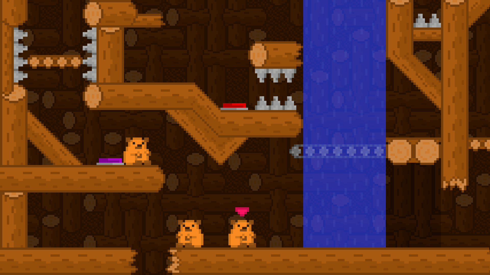
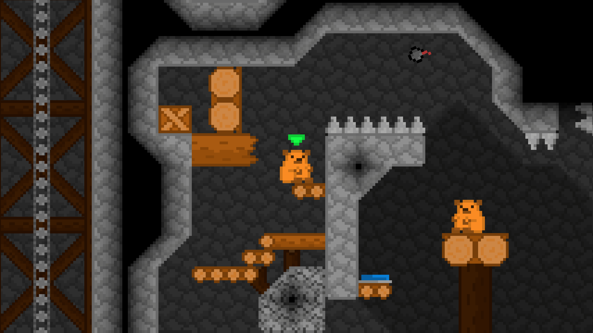
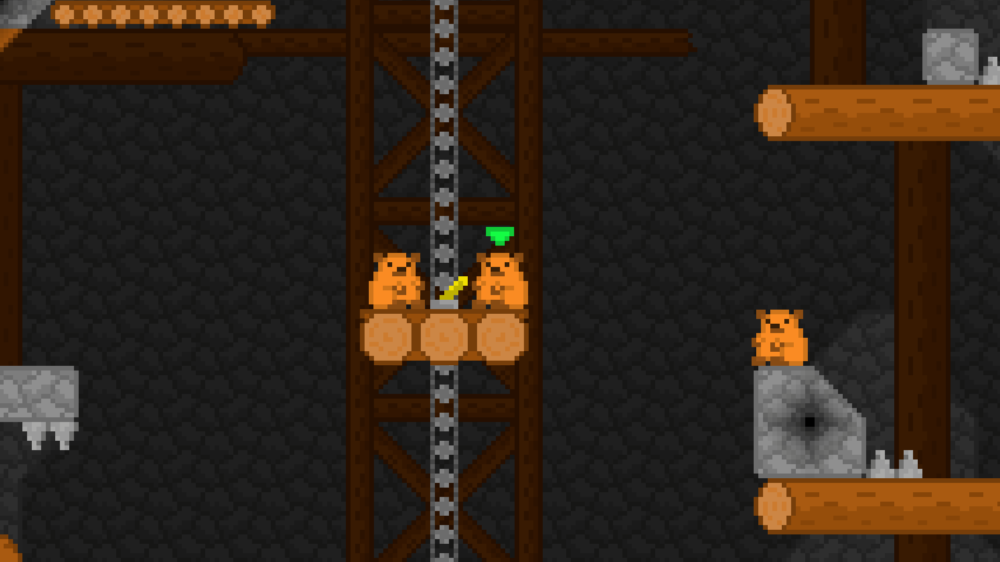
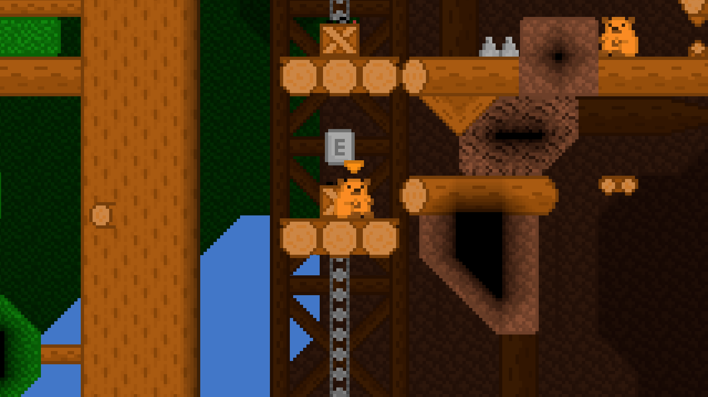
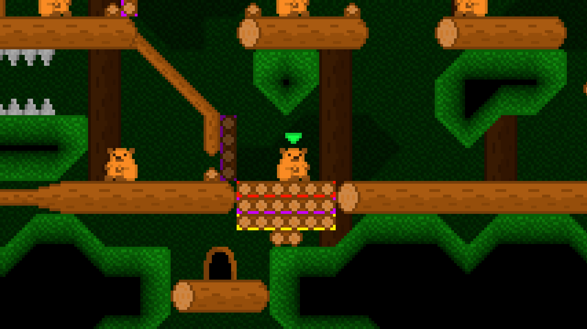

[download](https://thund3r3.itch.io/bob-bober), [walkthrough](https://www.youtube.com/watch?v=24LH_Y5FZL8)

Get the bobers of the White Oak forest colony to work together, collect the needed materials,
repair the dam and save the bober colony from a looming catastrophe in this 2D co-op puzzle platformer.

In its current state, the game is more of a tech-demo than a finished project. However, we are very happy
with the core game mechanics, and we would really like to return back to this project some day and rewrite it
from the ground up.

My contributions to the project:
- game mechanics implementation
- level design
- pixelart (all of the art is original, except for the [beaver](https://www.shutterstock.com/cs/image-vector/little-beaver-sitting-pixel-art-character-1461381407))


  
  
  
  
  

