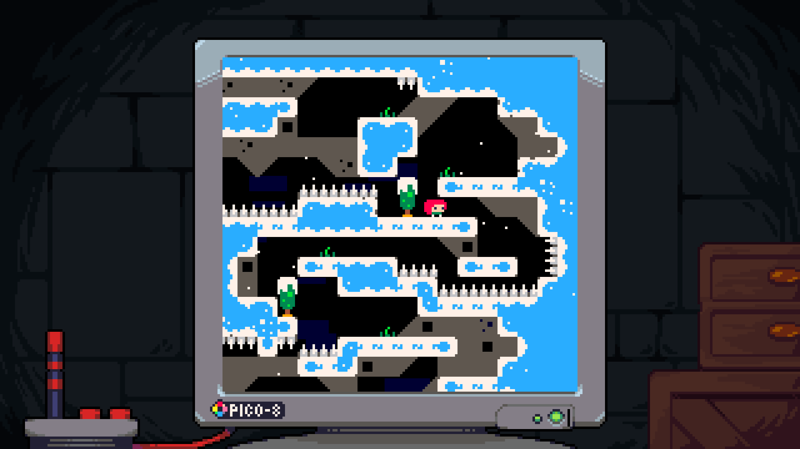
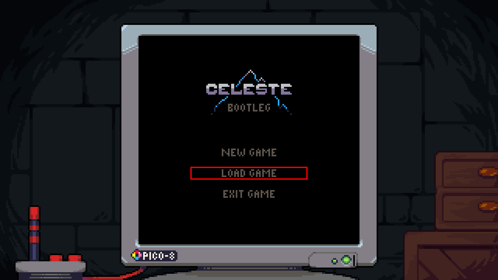
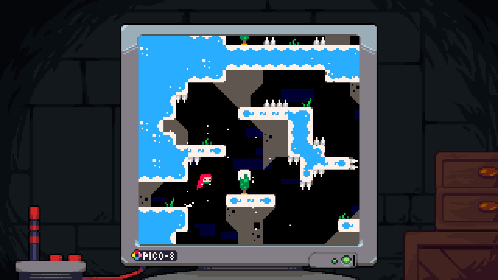


 src

  

A Python implementation of Celeste Classic (2015) using PyGame. Supports controllers. 




  
  
  


Most of the assets in this project were taken from the Celeste Classic (aka PICO-8) implementation inside of 
[Celeste (2018)](https://www.celestegame.com/).
