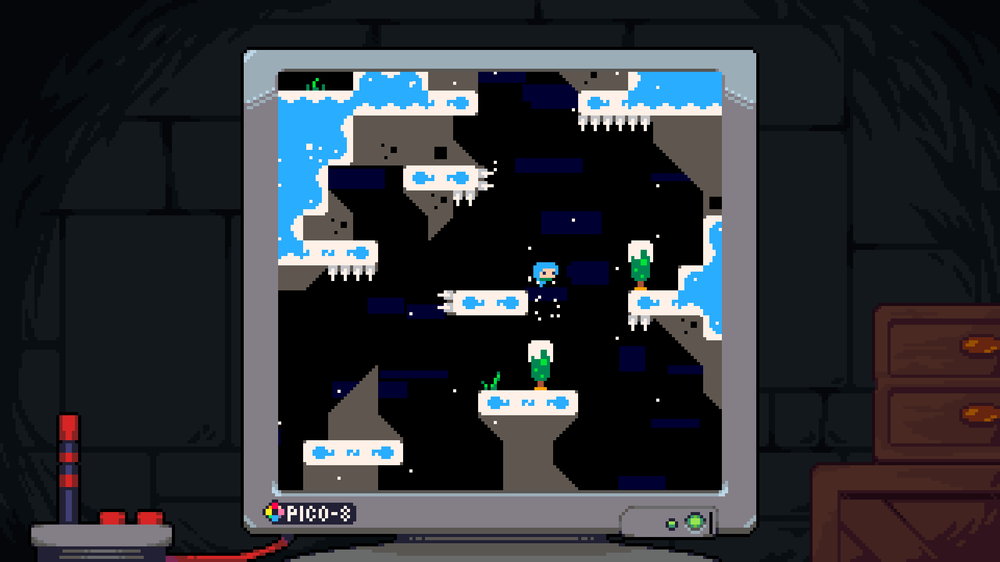

[src](https://github.com/michal-sladek/Celeste-PyGame/tree/semestral/semestral)

A Python implementation of Celeste Classic (2015) using PyGame. Supports controllers. 


  
  
  
  


Most of the assets in this project were taken from the Celeste Classic (aka PICO-8) implementation inside of Celeste (2018).
