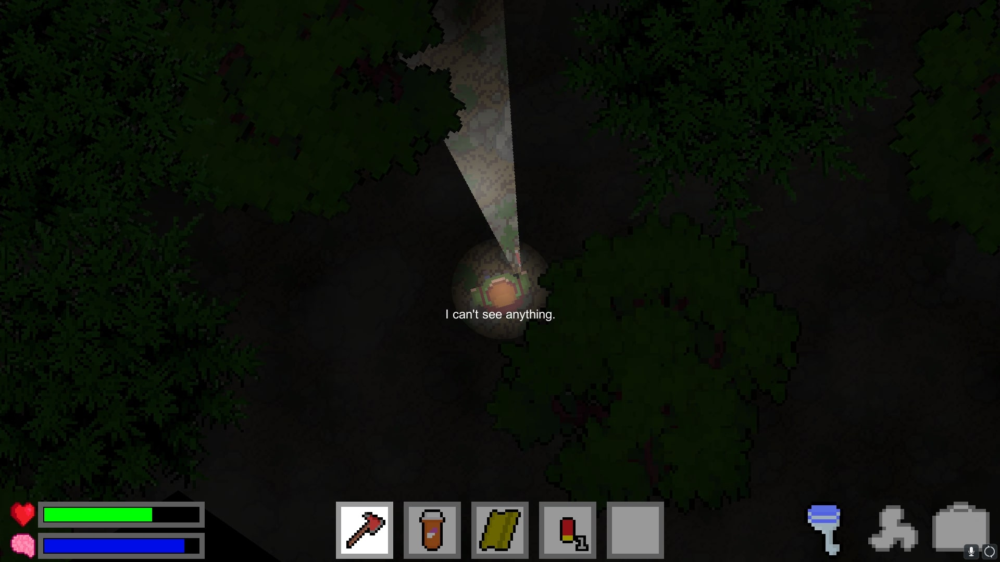
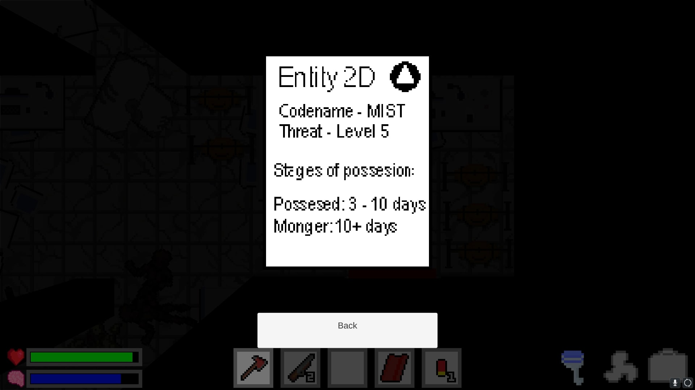
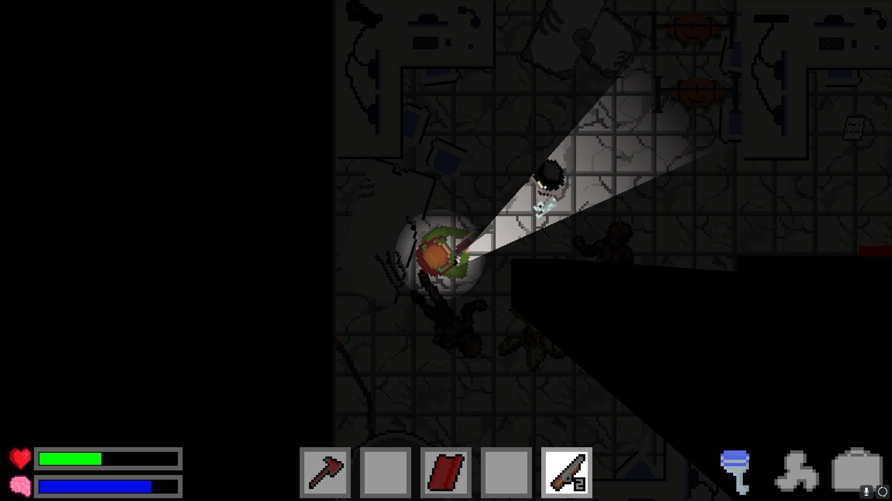
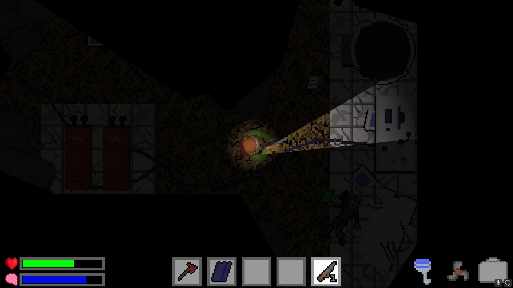


 download

  



MIST is a 2D top-down single-player survival horror game that was made in Unity.

You and your colleagues travel to a secret research facility on a remote island, when suddenly the
boat breaks down and crashes. After waking up, you notice that the others have gone missing
and that your only means of escape, the boat, is broken. Survive the darkness of the night,
fight enemies, collect items, keep yourself sane and escape the island.

My contributions to the project:
- UI & menus
- inventory & player interaction
- lighting
- level design
- game progression scripting




  
  
  
  

