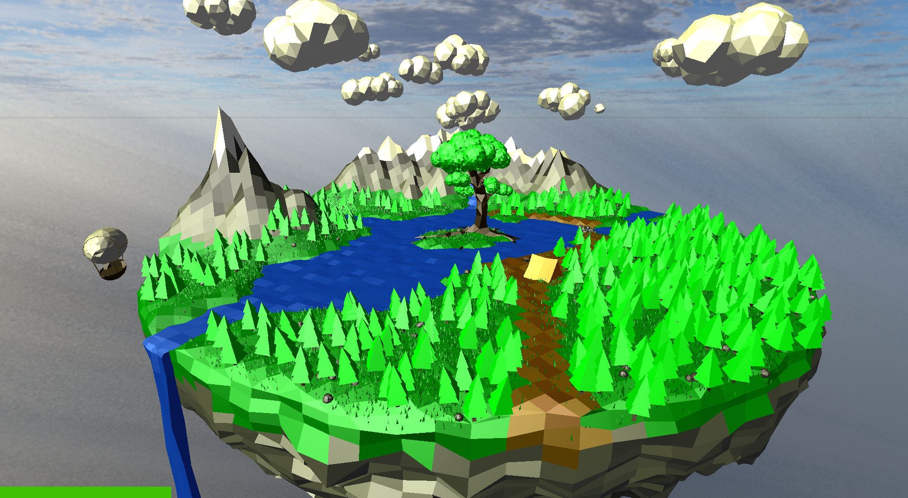
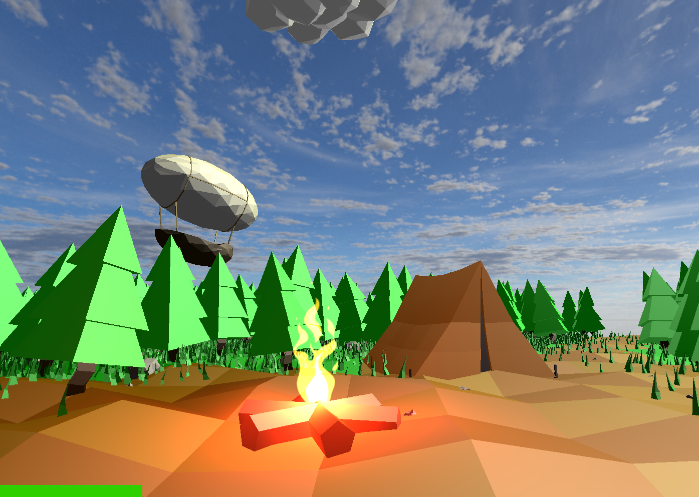
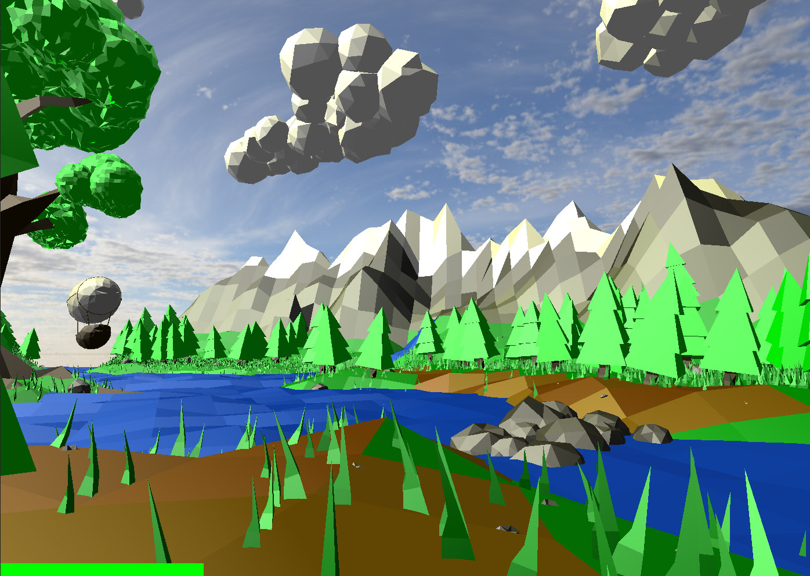


 src & manual

  

A simple rendering engine that served as a great tool for learning the OpenGL rendering pipeline, shading, texturing, 
camera navigation, spline animation and interaction.


  
  
  


