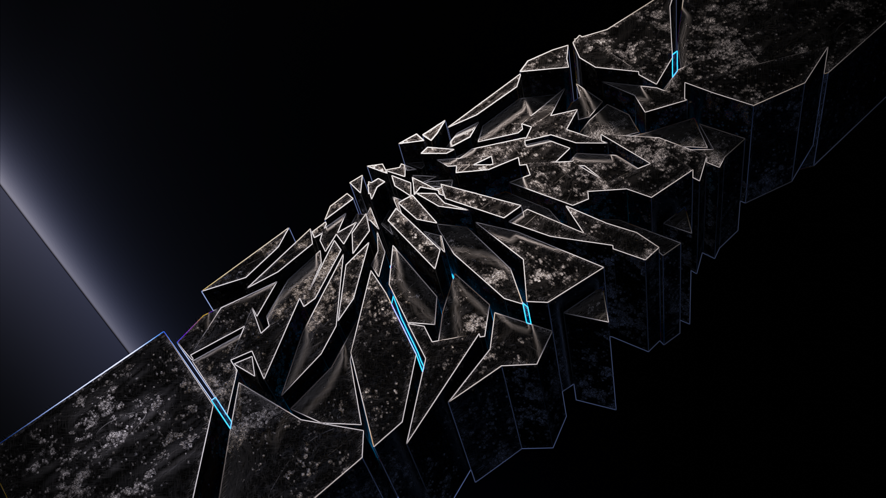
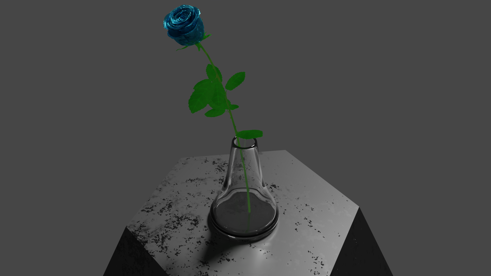
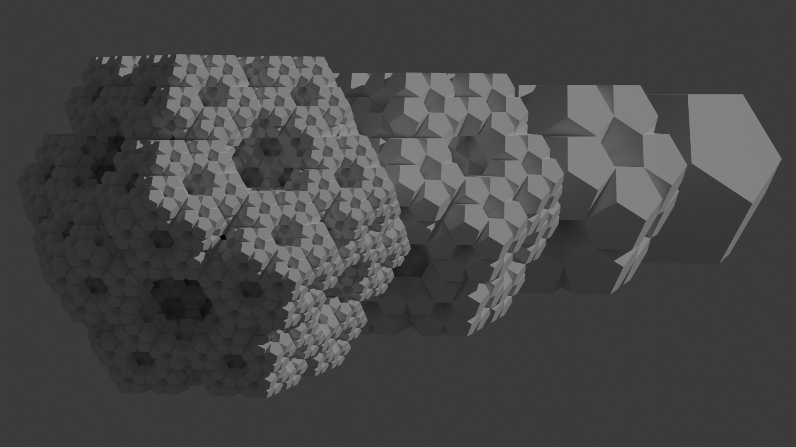
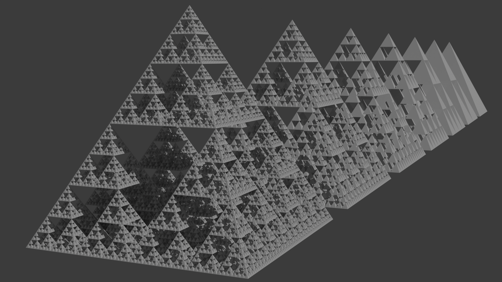
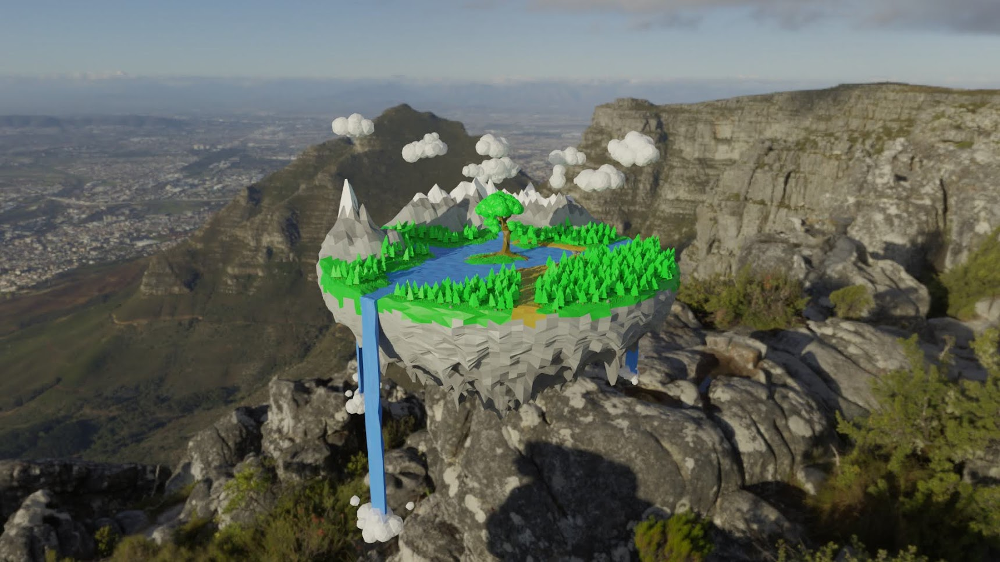
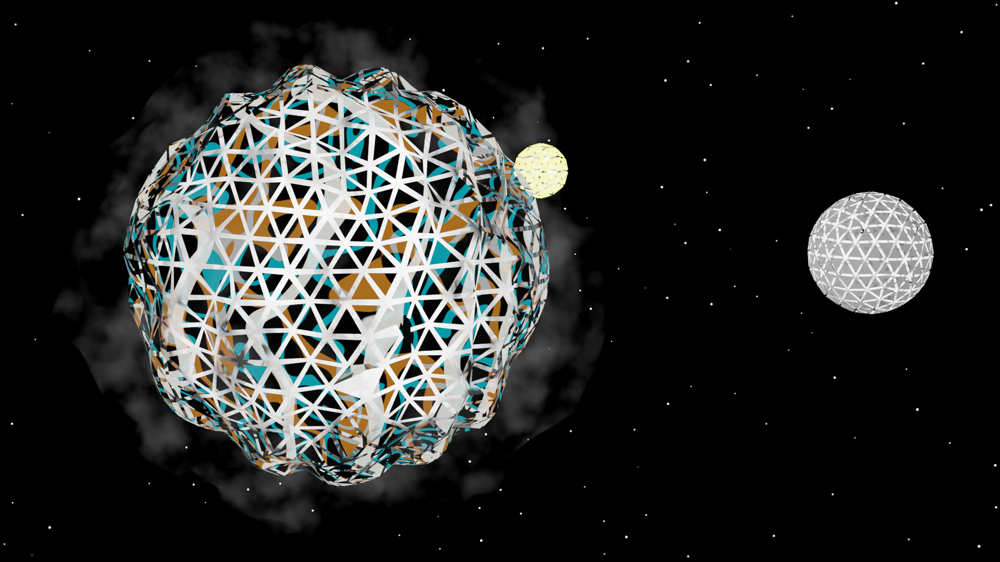
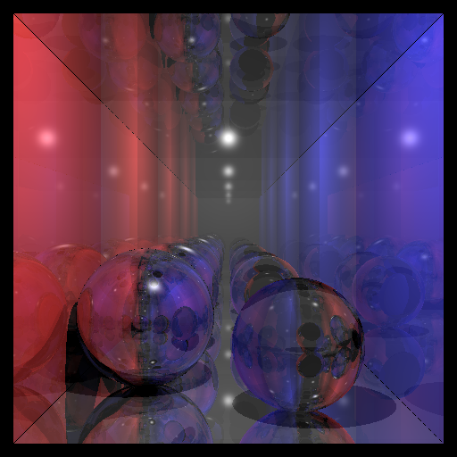
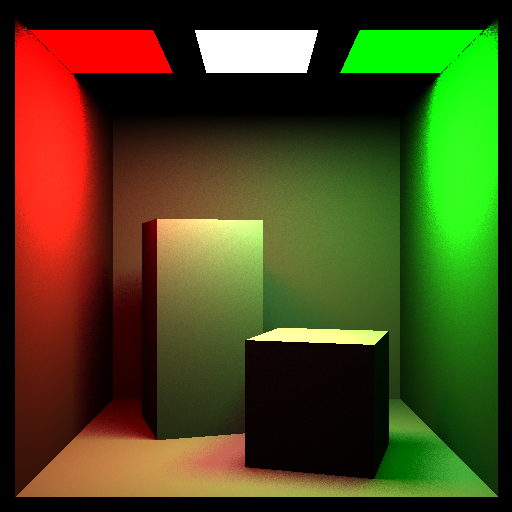
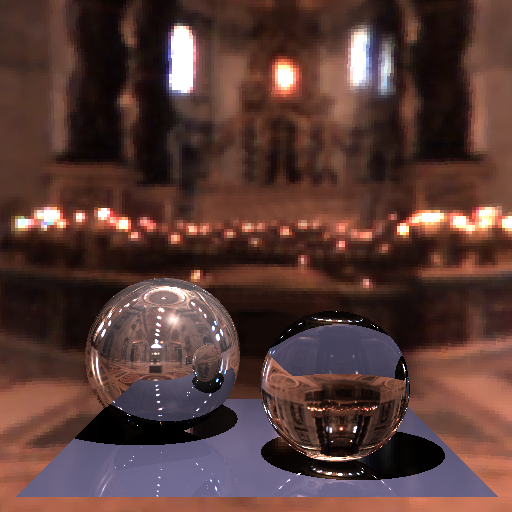
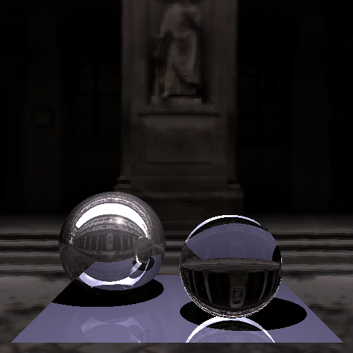


A collection of smaller projects.


## Particle-based fluid simulation

 UE5 
 C++ 
 Team 



 project files

  

A fluid simulation in Unreal Engine 5 based on the paper [*Particle-Based Fluid Simulation for Interactive Applications (Müller et al.)*](https://matthias-research.github.io/pages/publications/sca03.pdf)

The implementation calculates pressure and density at the position of each particle and uses these scalar fields to
calculate forces between particles. More information on the approach and implementation can be found in our
[report](/fluid_simulation_report.pdf).



## Blender

 Python 
 Solo 


For anything 3D-related, I really like using Blender. I especially enjoyed working with material nodes and 
creating procedural materials in my personal projects.

### procedural materials


  
  
  
  
  


### scripting


  
  


### minimalistic


  
  
  
  
  


### other



## Maya

 Solo 


I also tried using Autodesk Maya for its history-based approach to 3D modeling, but I found that 
Blender's workflow suits me better.


  
  


 


  
  
  
  
  


## Raytracing projects

 C++ 
 Solo 


Ray tracing is more relevant than ever thanks to modern, high-performance GPUs.

I have worked on two ray tracing projects. The first is a simple CPU-based ray tracer, which served as a great
learning exercise to understand the basic principles.


  
  
  
  


The second project focuses on optimizing the BVH (Bounding Volume Hierarchy) data structure used to 
accelerate ray–triangle intersection tests. The approach is based on the paper [*Fast Insertion-Based Optimization of
Bounding Volume Hierarchies (Bittner et al.)*](https://dcgi.fel.cvut.cz/wp-content/wpallimport-dist/publications/pdf/publications-2013-bittner-cgf-fiobvh-paper.pdf). 
It identifies inefficient nodes in the BVH using a cost heuristic, removes them, and reinserts their 
children in a way that minimizes the overall tree cost.

More information on this project can be found in my [report](/BVH_optimization.pdf).

Due to academic integrity policies, I am unable to share the source code for these implementations.