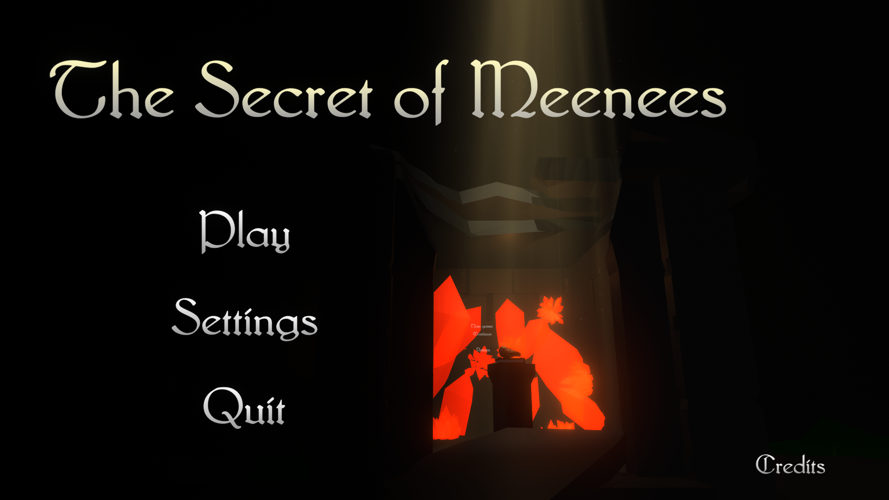
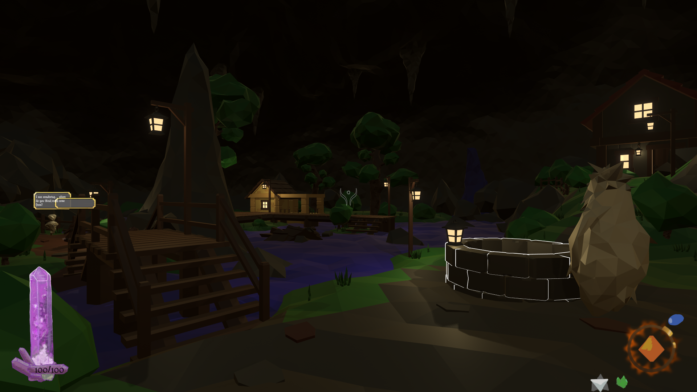
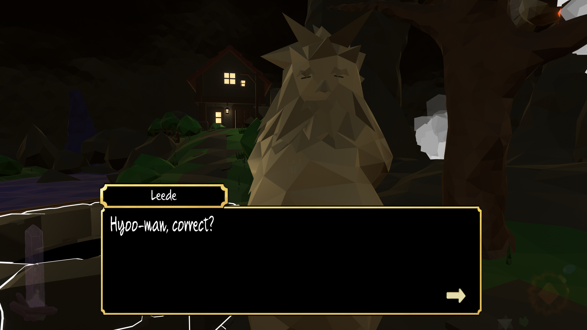
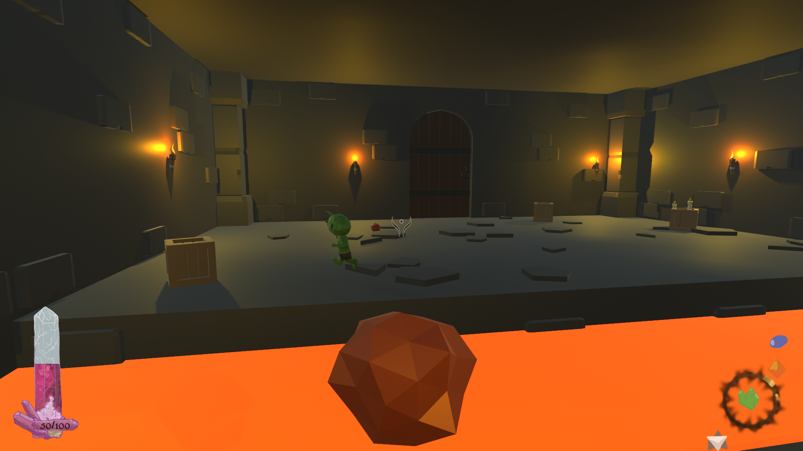
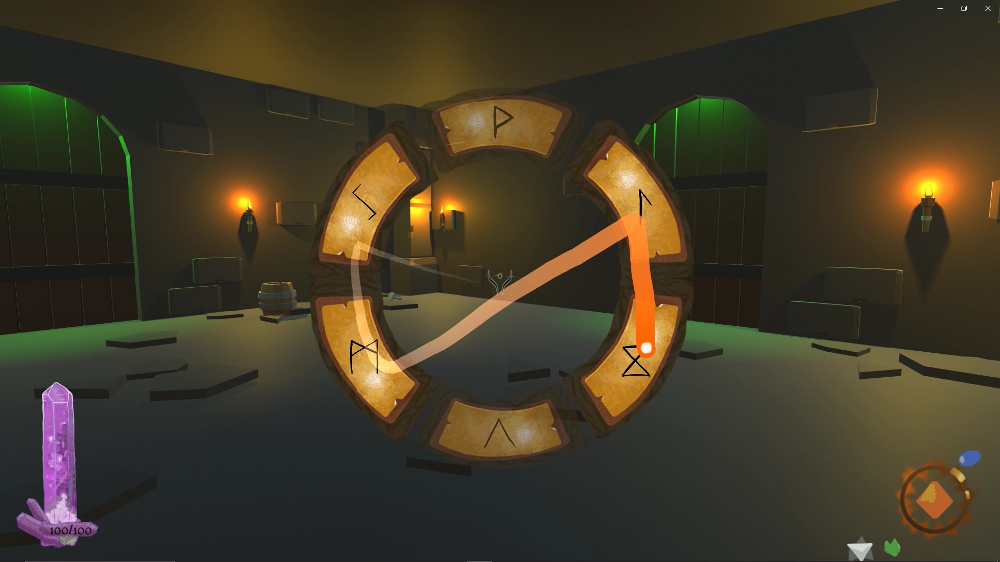
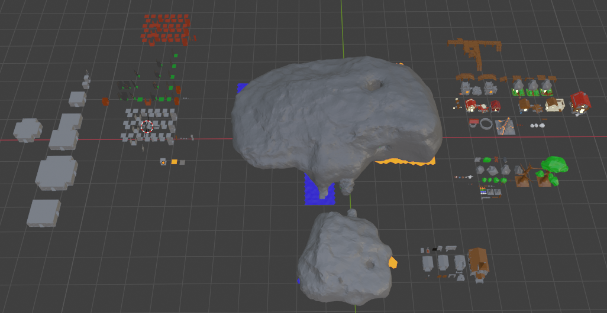
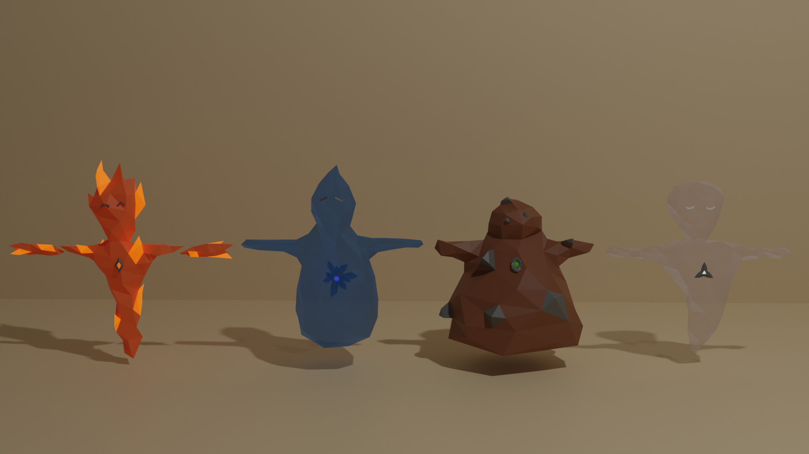
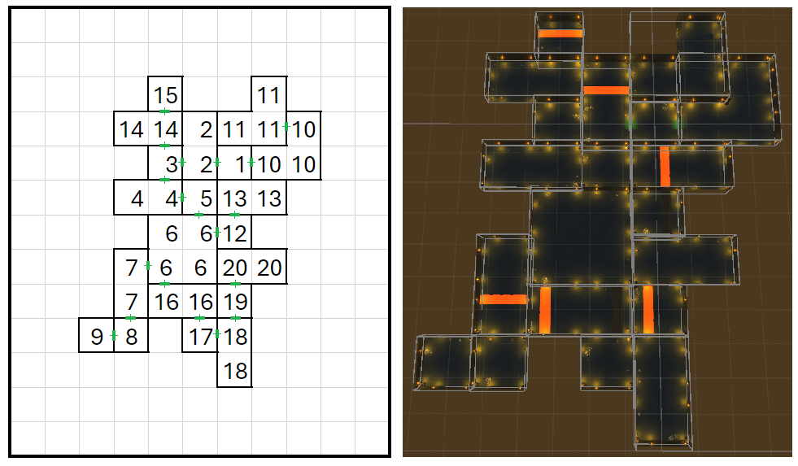
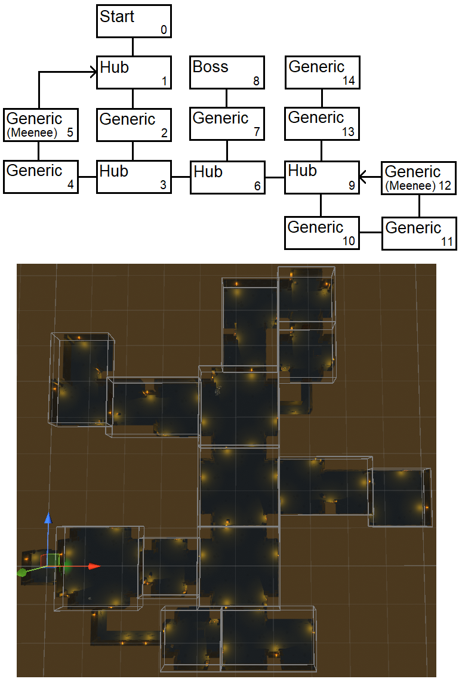
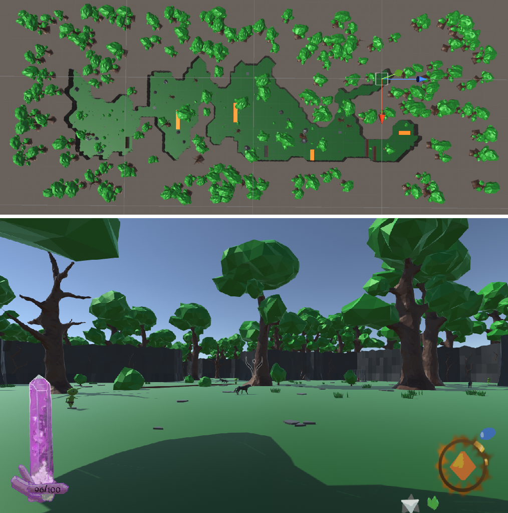


 download

  



The Secret of Meenees is a 3D first-person single-player fantasy dungeon crawler that was made in Unity.

You take on the role of a lone traveller that trips and falls into a cave while walking through a forest.
When you wake up you find yourself in a mysterious world.
Discover spells and save its inhabitants from the hordes of monsters that dwell deep in the dungeons below.
Can you reach the bottom and rescue every single Meenee?


  
  
  
  
  


Initially I only worked on the 3D low-poly assets in Blender, their imports to Unity and level design in Unity.
This project was later expanded into my [bachelor's thesis](https://dspace.cvut.cz/handle/10467/115667?show=full),
where I implemented 3 procedural generation algorithms for the different dungeon floors.


  
  
  
  
  


